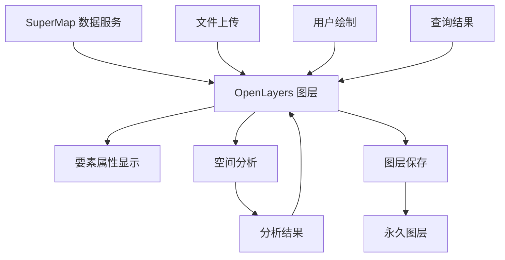

# 显示图层 - 数据源分析

## 数据源概述

系统中的数据主要来自以下几个来源，每个来源都有不同的数据特征和属性结构：

## 1. SuperMap 数据服务

### 数据来源
- **服务类型**：SuperMap iServer 数据服务
- **API 端点**：`/datasources/{datasource}/datasets/{dataset}/features.json`
- **数据格式**：GeoJSON FeatureCollection
- **坐标系统**：EPSG:4326

### 数据特征
```javascript
// SuperMap 数据服务返回的数据结构
{
  "type": "FeatureCollection",
  "features": [
    {
      "type": "Feature",
      "id": "feature_id",
      "geometry": {
        "type": "Polygon",
        "coordinates": [[[lng, lat], ...]]
      },
      "properties": {
        // 原始业务属性数据
        "name": "要素名称",
        "type": "要素类型",
        "area": 123.45,
        // ... 其他业务字段
      }
    }
  ]
}
```

### 数据加载方式
- **分页加载**：支持大数据集的分页查询
- **空间查询**：支持按边界范围查询
- **属性过滤**：支持按属性条件过滤
- **懒加载**：按需加载数据，提升性能

### 相关代码
- `Frontend/src/api/supermap.ts` - SuperMap 客户端
- `Frontend/src/composables/useMap.ts` - 地图数据加载

## 2. 文件上传数据

### 数据来源
- **文件类型**：GeoJSON (.geojson, .json)
- **上传方式**：用户通过界面选择文件上传
- **处理方式**：前端直接解析，转换为 OpenLayers 要素

### 数据特征
```javascript
// 上传的 GeoJSON 文件结构
{
  "type": "FeatureCollection",
  "features": [
    {
      "type": "Feature",
      "properties": {
        // 用户自定义的业务属性
        "id": "custom_id",
        "name": "自定义名称",
        "category": "分类",
        // ... 其他业务字段
      },
      "geometry": {
        "type": "Polygon",
        "coordinates": [[[lng, lat], ...]]
      }
    }
  ]
}
```

### 数据加载方式
- **直接解析**：使用 `JSON.parse()` 解析文件内容
- **格式转换**：使用 OpenLayers GeoJSON 格式器转换
- **投影处理**：自动处理坐标投影转换
- **批量上传**：支持多文件同时上传

### 相关代码
- `Frontend/src/views/dashboard/ViewPage/layout/DashboardViewHeader.vue` - 文件上传处理

## 3. 绘制数据

### 数据来源
- **创建方式**：用户在地图上手动绘制
- **绘制工具**：点、线、面绘制工具
- **实时创建**：绘制过程中实时生成要素

### 数据特征
```javascript
// 绘制生成的要素结构
{
  "type": "Feature",
  "geometry": {
    "type": "Polygon",
    "coordinates": [[[lng, lat], ...]]
  },
  "properties": {
    // 系统自动生成的几何属性
    "elementId": 1,
    "area": 635.555,
    "areaUnit": "平方千米",
    "sourceType": "draw",
    "saveTime": "2025-09-11T02:01:45.656Z",
    "layerName": "绘制面_09111001",
    "saveFormat": "polygon"
  }
}
```

### 数据特点
- **只有几何属性**：不包含业务属性数据
- **系统生成**：属性由系统自动计算和生成
- **临时性质**：绘制完成后可保存为永久图层

### 相关代码
- `Frontend/src/composables/useDrawing.ts` - 绘制功能
- `Frontend/src/composables/useLayerManager.ts` - 绘制图层管理

## 4. 分析结果数据

### 数据来源
- **生成方式**：通过空间分析功能生成
- **分析类型**：缓冲区、相交、擦除、最短路径等
- **后端处理**：由后端分析服务生成结果

### 数据特征
```javascript
// 分析结果数据结构
{
  "type": "Feature",
  "geometry": {
    "type": "Polygon",
    "coordinates": [[[lng, lat], ...]]
  },
  "properties": {
    // 保留的原始属性
    "originalField1": "原始值1",
    "originalField2": "原始值2",
    // 分析元数据
    "analysisType": "buffer",
    "distance": 100,
    "unit": "meters",
    "sourcelayer": "源图层名称",
    "createdAt": "2025-09-11T02:01:45.656Z"
  }
}
```

### 数据特点
- **属性继承**：保留输入图层的原始属性
- **元数据添加**：添加分析相关的元数据
- **结果标识**：通过 `analysisType` 标识分析类型

### 相关代码
- `Frontend/src/composables/useBufferAnalysis.ts` - 缓冲区分析
- `Frontend/src/composables/useIntersectionAnalysis.ts` - 相交分析
- `Frontend/src/composables/useEraseAnalysis.ts` - 擦除分析

## 5. 查询结果数据

### 数据来源
- **按属性查询**：根据属性条件查询要素
- **按区域选择**：根据空间范围选择要素
- **地图点击查询**：点击地图位置查询要素

### 数据特征
```javascript
// 查询结果数据结构
{
  "type": "Feature",
  "geometry": {
    "type": "Polygon",
    "coordinates": [[[lng, lat], ...]]
  },
  "properties": {
    // 完整的原始属性数据
    "id": "feature_id",
    "name": "要素名称",
    "type": "要素类型",
    "area": 123.45,
    // ... 所有原始业务属性
  }
}
```

### 数据特点
- **属性完整**：保留所有原始业务属性
- **无修改**：不对原始数据进行修改
- **选择性质**：从现有数据中选择符合条件的要素

### 相关代码
- `Frontend/src/views/dashboard/management-analysis/traditional/tools/FeatureQueryPanel.vue` - 按属性查询
- `Frontend/src/views/dashboard/management-analysis/traditional/tools/AreaSelectionTools.vue` - 按区域选择

## 数据源对比分析

### 属性数据完整性

| 数据源类型 | 业务属性 | 几何属性 | 系统属性 | 元数据 |
|-----------|---------|---------|---------|--------|
| SuperMap 服务 | ✅ 完整 | ✅ 自动计算 | ❌ 无 | ❌ 无 |
| 文件上传 | ✅ 完整 | ✅ 自动计算 | ❌ 无 | ❌ 无 |
| 绘制数据 | ❌ 无 | ✅ 自动计算 | ✅ 完整 | ✅ 完整 |
| 分析结果 | ✅ 继承 | ✅ 自动计算 | ✅ 部分 | ✅ 完整 |
| 查询结果 | ✅ 完整 | ✅ 自动计算 | ❌ 无 | ❌ 无 |

### 数据流转过程



## 要素属性显示机制

### 统一显示函数
所有数据源都使用相同的显示机制：

```javascript
// 核心显示函数
export function getFeatureCompleteInfo(feature: any): Array<{label: string, value: string}> {
  const properties = feature.getProperties ? feature.getProperties() : feature.properties || {}
  const info: Array<{label: string, value: string}> = []
  
  // 遍历所有属性，排除几何字段
  Object.keys(properties).forEach(key => {
    if (key !== 'geometry') {
      const value = properties[key]
      const displayValue = formatPropertyValue(value)
      if (displayValue !== undefined) {
        info.push({ label: key, value: displayValue })
      }
    }
  })
  
  return info
}
```

### 属性值格式化
```javascript
export function formatPropertyValue(value: any): string | undefined {
  if (value === null || value === undefined) return '(空值)'
  if (typeof value === 'string') return value
  if (typeof value === 'number') return String(value)
  if (typeof value === 'boolean') return value ? 'true' : 'false'
  if (value instanceof Date) return value.toLocaleDateString()
  if (Array.isArray(value)) {
    if (value.length === 0) return '[]'
    if (value.length <= 3) {
      return `[${value.map(v => formatPropertyValue(v)).join(', ')}]`
    }
    return `[${value.length}个元素]`
  }
  // 跳过对象类型
  if (typeof value === 'object') {
    return undefined
  }
  return String(value)
}
```

## 数据源选择建议

### 用于分析的数据源选择

1. **推荐使用**：
   - SuperMap 数据服务：包含完整业务属性
   - 文件上传数据：包含完整业务属性

2. **不推荐使用**：
   - 绘制数据：只有几何属性，无业务属性
   - 分析结果：可能丢失部分原始属性

### 属性保留策略

1. **分析前检查**：确认数据源包含所需的业务属性
2. **属性验证**：在分析前验证属性完整性
3. **结果验证**：分析后验证属性是否正确保留

## 相关文件

- `Frontend/src/api/supermap.ts` - SuperMap 数据服务客户端
- `Frontend/src/utils/featureUtils.ts` - 要素属性处理工具
- `Frontend/src/composables/useLayerManager.ts` - 图层管理
- `Frontend/src/views/dashboard/ViewPage/layout/DashboardViewHeader.vue` - 文件上传
- `Frontend/src/composables/useBufferAnalysis.ts` - 缓冲区分析
- `Frontend/src/composables/useIntersectionAnalysis.ts` - 相交分析
- `Frontend/src/composables/useEraseAnalysis.ts` - 擦除分析
