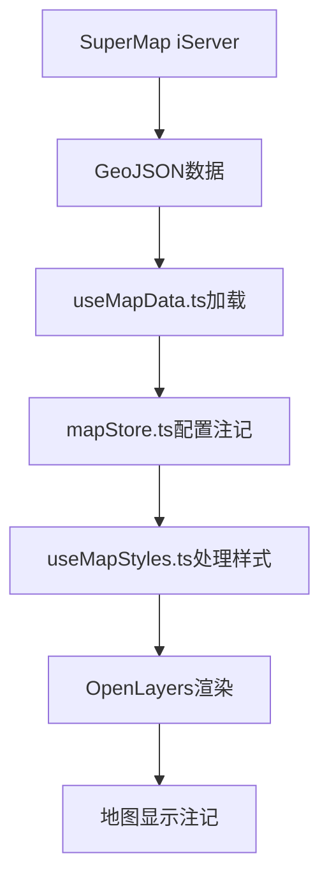

# 注记添加方法文档

## 概述

本文档详细说明如何在SuperMap GIS系统中为各个图层添加注记（标签），包括配置位置、数据源、字段映射和样式设置。

## 1. 注记配置架构

### 1.1 核心文件结构
```
Frontend/src/
├── stores/mapStore.ts          # 注记配置定义
├── composables/useMapStyles.ts # 注记样式处理
├── composables/useMapData.ts   # 数据加载
└── utils/config.ts             # 数据源配置
```

### 1.2 数据流向


## 2. 注记配置位置

### 2.1 主要配置：`mapStore.ts`

**位置：** `Frontend/src/stores/mapStore.ts` (第160-179行)

```typescript
// 特殊处理县级图层，使用主题色并添加文本注记
const layerName = layer.name.split('@')[0] || layer.name
if (layerName === '武汉_县级') {
  return {
    name: layer.name,
    style: {
      stroke: { width: 2, color: 'var(--layer-stroke-武汉_县级)' },
      fill: { color: 'var(--layer-fill-武汉_县级)' },
      text: {
        text: '{NAME_1}', // 显示NAME_1字段
        font: '14px sans-serif',
        fill: { color: 'var(--accent)' }, // 使用主题颜色
        stroke: { color: '#ffffff', width: 2 }, // 白色描边
        offsetY: 0,
        textAlign: 'center',
        textBaseline: 'middle'
      }
    }
  }
}
```

### 2.2 样式处理：`useMapStyles.ts`

**位置：** `Frontend/src/composables/useMapStyles.ts` (第113-144行)

```typescript
// 处理动态文本样式
if (styleConfig.text) {
  const properties = feature.getProperties();
  let textContent = styleConfig.text.text;
  
  // 替换文本模板中的字段占位符
  if (textContent.includes('{NAME_1}')) {
    textContent = textContent.replace('{NAME_1}', properties.NAME_1 || '');
  }
  if (textContent.includes('{NAME}')) {
    textContent = textContent.replace('{NAME}', properties.NAME || '');
  }
  
  const textConfig: any = {
    text: textContent,
    font: styleConfig.text.font || '12px sans-serif',
    fill: new ol.style.Fill({
      color: parseColor(styleConfig.text.fill.color)
    }),
    offsetY: styleConfig.text.offsetY || 0,
    textAlign: styleConfig.text.textAlign || 'center',
    textBaseline: styleConfig.text.textBaseline || 'middle'
  };
  
  // 处理文本描边
  if (styleConfig.text.stroke) {
    textConfig.stroke = new ol.style.Stroke({
      color: parseColor(styleConfig.text.stroke.color),
      width: styleConfig.text.stroke.width
    });
  }
  
  styleObj.text = new ol.style.Text(textConfig);
}
```

## 3. 数据源配置

### 3.1 服务器配置：`config.ts`

**位置：** `Frontend/src/utils/config.ts`

```typescript
// SuperMap iServer 服务器基础地址
const baseUrl = import.meta.env.VITE_SUPERMAP_BASE_URL 

// 数据服务REST API路径 - 用于矢量要素数据获取
const dataService = import.meta.env.VITE_SUPERMAP_DATA_SERVICE

// 数据源工作空间名称
const workspace = import.meta.env.VITE_SUPERMAP_WORKSPACE
```

### 3.2 环境变量配置

| 环境变量 | 说明 | 示例值 |
|---------|------|--------|
| `VITE_SUPERMAP_BASE_URL` | 服务器基础地址 | `http://localhost:8090` |
| `VITE_SUPERMAP_DATA_SERVICE` | 数据服务路径 | `iserver/services/data-xxx/rest/data` |
| `VITE_SUPERMAP_WORKSPACE` | 工作空间名称 | `workspace_name` |

### 3.3 数据加载：`useMapData.ts`

**位置：** `Frontend/src/composables/useMapData.ts` (第80-84行)

```typescript
// 连接SuperMap iServer数据服务
const featureService = new ol.supermap.FeatureService(mapStore.mapConfig.dataUrl);

// 解析图层名称获取数据集和数据源信息
// 格式：图层名@数据源@@工作空间
```

## 4. 注记字段说明

### 4.1 主要注记字段

| 字段名 | 说明 | 使用场景 | 示例值 |
|--------|------|----------|--------|
| `NAME_1` | 县级行政区名称 | 武汉_县级图层 | 江岸区、江汉区、硚口区 |
| `NAME` | 通用名称字段 | 其他图层 | 要素名称 |
| `TYPE` | 类型字段 | 分类显示 | 学校、医院、道路 |
| `CODE` | 编码字段 | 标识显示 | 420102、420103 |

### 4.2 数据来源结构

```javascript
// SuperMap iServer 返回的GeoJSON数据结构
{
  "type": "FeatureCollection",
  "features": [
    {
      "type": "Feature",
      "id": "feature_id",
      "geometry": {
        "type": "Polygon",
        "coordinates": [[[lng, lat], ...]]
      },
      "properties": {
        "NAME_1": "江岸区",        // 注记字段
        "NAME": "江岸区",          // 备用注记字段
        "TYPE": "行政区",          // 类型字段
        "CODE": "420102",         // 编码字段
        "AREA": 123.45,           // 面积字段
        // ... 其他业务字段
      }
    }
  ]
}
```

## 5. 添加新图层注记的方法

### 5.1 步骤1：在mapStore.ts中配置

```typescript
// 在createMapConfig()函数中添加新的图层注记配置
if (layerName === '新图层名称') {
  return {
    name: layer.name,
    style: {
      stroke: { width: 2, color: 'var(--layer-stroke-新图层名称)' },
      fill: { color: 'var(--layer-fill-新图层名称)' },
      text: {
        text: '{字段名}', // 替换为实际字段名
        font: '14px sans-serif',
        fill: { color: 'var(--accent)' },
        stroke: { color: '#ffffff', width: 2 },
        offsetY: 0,
        textAlign: 'center',
        textBaseline: 'middle'
      }
    }
  }
}
```

### 5.2 步骤2：在useMapStyles.ts中添加字段处理

```typescript
// 在字段替换逻辑中添加新字段
if (textContent.includes('{新字段名}')) {
  textContent = textContent.replace('{新字段名}', properties.新字段名 || '');
}
```

### 5.3 步骤3：在theme.css中添加样式变量

```css
/* 在theme.css中添加图层样式变量 */
:root {
  --layer-stroke-新图层名称: #1890ff;
  --layer-fill-新图层名称: #e6f7ff;
}
```

## 6. 注记样式配置

### 6.1 文本样式属性

| 属性 | 说明 | 可选值 | 默认值 |
|------|------|--------|--------|
| `text` | 显示文本 | `{字段名}` | - |
| `font` | 字体样式 | `14px sans-serif` | `12px sans-serif` |
| `fill.color` | 文字颜色 | CSS颜色值 | `var(--accent)` |
| `stroke.color` | 描边颜色 | CSS颜色值 | `#ffffff` |
| `stroke.width` | 描边宽度 | 数字 | `2` |
| `offsetY` | Y轴偏移 | 数字 | `0` |
| `textAlign` | 水平对齐 | `left/center/right` | `center` |
| `textBaseline` | 垂直对齐 | `top/middle/bottom` | `middle` |

### 6.2 样式示例

```typescript
// 基础注记样式
text: {
  text: '{NAME_1}',
  font: '14px sans-serif',
  fill: { color: 'var(--accent)' },
  stroke: { color: '#ffffff', width: 2 },
  offsetY: 0,
  textAlign: 'center',
  textBaseline: 'middle'
}

// 大字体注记样式
text: {
  text: '{NAME}',
  font: '18px bold sans-serif',
  fill: { color: '#ff4d4f' },
  stroke: { color: '#ffffff', width: 3 },
  offsetY: -5,
  textAlign: 'center',
  textBaseline: 'middle'
}

// 小字体注记样式
text: {
  text: '{CODE}',
  font: '10px sans-serif',
  fill: { color: '#666666' },
  stroke: { color: '#ffffff', width: 1 },
  offsetY: 10,
  textAlign: 'center',
  textBaseline: 'middle'
}
```

## 7. 常见问题解决

### 7.1 注记不显示

**可能原因：**
1. 字段名不匹配
2. 数据中字段值为空
3. 样式配置错误

**解决方法：**
```typescript
// 检查字段是否存在
if (textContent.includes('{NAME_1}')) {
  const fieldValue = properties.NAME_1 || properties.name || '未知';
  textContent = textContent.replace('{NAME_1}', fieldValue);
}
```

### 7.2 注记位置偏移

**调整方法：**
```typescript
text: {
  text: '{NAME_1}',
  offsetY: -10,  // 向上偏移10px
  offsetX: 5,    // 向右偏移5px
  textAlign: 'left',
  textBaseline: 'top'
}
```

### 7.3 注记样式不生效

**检查步骤：**
1. 确认CSS变量已定义
2. 检查字段替换逻辑
3. 验证OpenLayers样式对象创建

## 8. 最佳实践

### 8.1 性能优化
- 使用懒加载减少初始加载时间
- 合理设置注记显示级别
- 避免过多注记同时显示

### 8.2 用户体验
- 注记文字清晰易读
- 颜色对比度适中
- 位置不遮挡重要信息

### 8.3 维护性
- 统一注记配置管理
- 使用CSS变量控制样式
- 文档化字段映射关系

## 9. 相关文件

- `Frontend/src/stores/mapStore.ts` - 注记配置定义
- `Frontend/src/composables/useMapStyles.ts` - 注记样式处理
- `Frontend/src/composables/useMapData.ts` - 数据加载
- `Frontend/src/utils/config.ts` - 数据源配置
- `Frontend/src/styles/theme.css` - 样式变量定义
- `Frontend/docs/8.读取数据流程.md` - 数据读取流程
- `Frontend/docs/14.显示图层.md` - 图层显示说明
