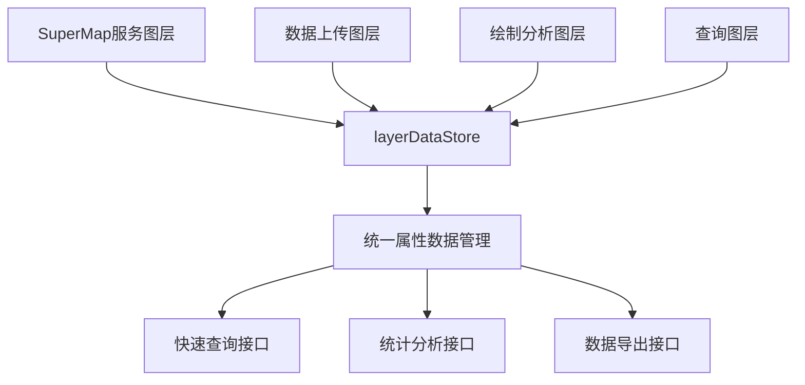

# 属性数据管理方式

## 概述

本文档描述了前端系统中所有图层属性数据的统一管理方式。通过 `layerDataStore` 实现所有图层（SuperMap服务图层、数据上传、绘制分析、查询图层）的属性数据统一存储和管理。

## 核心架构

### 1. 统一存储中心

**文件位置**：`Frontend/src/stores/layerDataStore.ts`

**核心数据结构**：
```typescript
export const useLayerDataStore = defineStore('layerData', () => {
  // 图层属性数据存储
  const layerAttributes = ref<Map<string, any[]>>(new Map())
  
  // 当前激活的图层数据（快速查找）
  const activeLayerData = ref<Map<string, any>>(new Map())
})
```

### 2. 数据流转架构



## 各功能数据保存方式

### 1. SuperMap服务图层

**保存位置**：`Frontend/src/composables/useMapData.ts`

**保存时机**：图层加载完成后

**保存代码**：
```typescript
// 在 loadVectorLayer 函数中
layerDataStore.setLayerAttributes(layerName, features)
```

**数据来源**：SuperMap iServer 服务器返回的要素数据

### 2. 数据上传图层

**保存位置**：`Frontend/src/composables/useDataUpload.ts`

**保存时机**：文件上传并创建图层后

**保存代码**：
```typescript
// 在 performUpload 函数中
const featuresData = features.map((feature: any) => ({
  id: feature.getId() || `${finallayerName}_${Date.now()}_${Math.random()}`,
  properties: feature.getProperties()
}))
layerDataStore.setLayerAttributes(finallayerName, featuresData)
```

**数据来源**：用户上传的GeoJSON文件解析后的要素数据

### 3. 绘制分析图层

**保存位置**：`Frontend/src/composables/useLayerManager.ts`

**保存时机**：绘制要素保存为图层后

**保存代码**：
```typescript
// 在 saveFeaturesAslayer 函数中
const featuresData = validFeatures.map((feature: any, index: number) => ({
  id: feature.getId() || `${sourceType}_${Date.now()}_${index}`,
  properties: feature.getProperties()
}))
layerDataStore.setLayerAttributes(layerName, featuresData)
```

**数据来源**：用户绘制的点、线、面要素

### 4. 查询图层

**保存位置**：`Frontend/src/stores/featureQueryStore.ts`

**保存时机**：查询结果应用后

**保存代码**：
```typescript
// 在 applyQuerySelection 函数中
const queryLayerName = `查询结果_${layerName}_${Date.now()}`
const featuresData = unique.map((feature: any, index: number) => ({
  id: feature.getId() || `query_${Date.now()}_${index}`,
  properties: feature.getProperties ? feature.getProperties() : feature.properties || {}
}))
layerDataStore.setLayerAttributes(queryLayerName, featuresData)
```

**数据来源**：按条件查询筛选出的要素数据

## 统一数据结构

### 要素数据格式

所有图层都使用统一的数据结构：

```typescript
interface FeatureData {
  id: string | number;           // 要素唯一标识
  properties: Record<string, any>; // 要素属性数据
}
```

### 图层数据格式

```typescript
// layerAttributes: Map<string, FeatureData[]>
// 键：图层名称
// 值：该图层的所有要素数据数组

// activeLayerData: Map<string, Map<string, any>>
// 键：图层名称
// 值：该图层的属性映射表（要素ID -> 属性数据）
```

## 核心API接口

### 1. 数据设置接口

```typescript
/**
 * 设置图层属性数据
 * @param layerName 图层名称
 * @param features 要素数据数组
 */
const setLayerAttributes = (layerName: string, features: any[]) => void
```

### 2. 数据查询接口

```typescript
/**
 * 获取图层属性数据
 * @param layerName 图层名称
 * @returns 图层属性数据数组
 */
const getLayerAttributes = (layerName: string): any[]

/**
 * 根据要素ID获取属性数据
 * @param layerName 图层名称
 * @param featureId 要素ID
 * @returns 要素属性数据
 */
const getFeatureAttributes = (layerName: string, featureId: string | number): any

/**
 * 获取图层中指定字段的所有值
 * @param layerName 图层名称
 * @param fieldName 字段名称
 * @returns 字段值数组
 */
const getFieldValues = (layerName: string, fieldName: string): any[]

/**
 * 根据字段值查找要素
 * @param layerName 图层名称
 * @param fieldName 字段名称
 * @param fieldValue 字段值
 * @returns 匹配的要素数组
 */
const findFeaturesByField = (layerName: string, fieldName: string, fieldValue: any): any[]
```

### 3. 数据管理接口

```typescript
/**
 * 清空指定图层数据
 * @param layerName 图层名称
 */
const clearLayerData = (layerName: string) => void

/**
 * 清空所有图层数据
 */
const clearAllLayerData = () => void
```

### 4. 统计信息接口

```typescript
/**
 * 获取所有图层名称
 */
const getAllLayerNames = computed(() => string[])

/**
 * 获取图层数据统计信息
 */
const getLayerStats = computed(() => Record<string, number>)
```

## 使用示例

### 1. 获取图层所有属性数据

```typescript
import { useLayerDataStore } from '@/stores/layerDataStore'

const layerDataStore = useLayerDataStore()
const features = layerDataStore.getLayerAttributes('武汉_县级')
console.log('县级图层要素数量:', features.length)
```

### 2. 根据字段查询要素

```typescript
// 查找所有人口大于100万的区县
const populousDistricts = layerDataStore.findFeaturesByField(
  '武汉_县级', 
  'population', 
  (value) => value > 1000000
)
```

### 3. 获取字段统计信息

```typescript
// 获取所有区县的人口数据
const populations = layerDataStore.getFieldValues('武汉_县级', 'population')
const totalPopulation = populations.reduce((sum, pop) => sum + pop, 0)
```

### 4. 图层数据统计

```typescript
// 获取所有图层的要素数量统计
const stats = layerDataStore.getLayerStats
console.log('图层统计:', stats)
// 输出: { '武汉_县级': 12, '建筑物面': 1500, '上传图层_1': 25 }
```

## 数据生命周期

### 1. 数据创建

- **SuperMap图层**：地图初始化时自动加载
- **上传图层**：用户上传文件时创建
- **绘制图层**：用户保存绘制要素时创建
- **查询图层**：执行查询操作时创建

### 2. 数据更新

- 所有图层数据在创建后立即保存到 `layerDataStore`
- 数据更新时同步更新存储
- 支持增量更新和全量替换

### 3. 数据清理

- **页面刷新**：所有数据清空，需要重新加载
- **图层删除**：调用 `clearLayerData` 清理指定图层
- **应用重启**：调用 `clearAllLayerData` 清理所有数据

## 性能优化

### 1. 双重索引结构

- **layerAttributes**：数组形式，便于遍历和统计
- **activeLayerData**：Map形式，便于快速查找

### 2. 内存管理

- 使用 `Map` 结构减少内存占用
- 支持按需清理不需要的图层数据
- 避免重复存储相同数据

### 3. 查询优化

- 提供多种查询接口满足不同需求
- 支持字段级别的快速查询
- 计算属性缓存统计结果

## 扩展性设计

### 1. 新功能集成

添加新的图层类型时，只需在对应的composable中调用 `setLayerAttributes` 即可：

```typescript
// 新功能示例
const newFeaturesData = newFeatures.map(feature => ({
  id: feature.getId(),
  properties: feature.getProperties()
}))
layerDataStore.setLayerAttributes(newLayerName, newFeaturesData)
```

### 2. 自定义查询接口

可以基于现有API扩展更复杂的查询功能：

```typescript
// 扩展查询示例
const findFeaturesByMultipleFields = (layerName: string, conditions: Record<string, any>) => {
  const features = layerDataStore.getLayerAttributes(layerName)
  return features.filter(feature => {
    return Object.entries(conditions).every(([field, value]) => 
      feature.properties[field] === value
    )
  })
}
```

## 最佳实践

### 1. 图层命名规范

- **SuperMap图层**：使用原始图层名称
- **上传图层**：使用用户指定的名称
- **绘制图层**：使用系统生成的描述性名称
- **查询图层**：使用 `查询结果_${源图层}_${时间戳}` 格式

### 2. 数据一致性

- 确保所有功能都使用统一的数据结构
- 在数据保存时进行格式验证
- 保持与OpenLayers要素的同步

### 3. 错误处理

- 在数据保存时进行异常捕获
- 提供数据验证和清理机制
- 记录详细的操作日志

## 总结

通过 `layerDataStore` 实现了所有图层属性数据的统一管理，提供了：

1. **统一的数据存储**：所有图层数据集中管理
2. **丰富的查询接口**：支持多种查询需求
3. **高性能访问**：双重索引结构优化查询性能
4. **良好的扩展性**：易于集成新功能
5. **完整的数据生命周期**：从创建到清理的全流程管理

这种设计确保了系统的一致性和可维护性，为后续功能扩展提供了坚实的基础。
