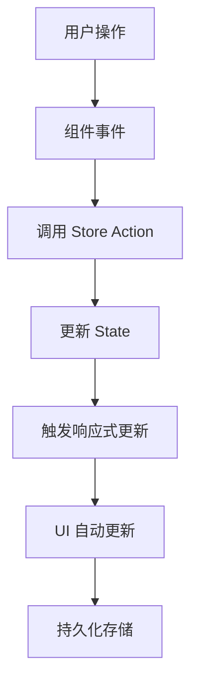
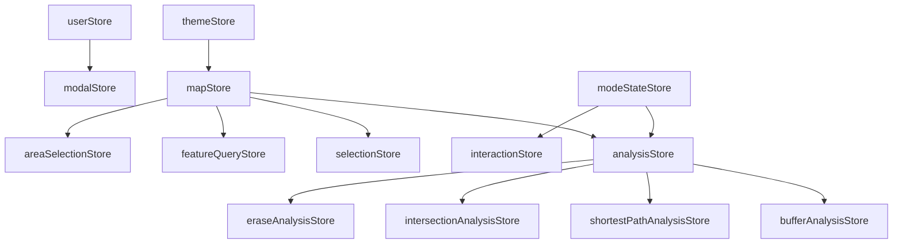

# 状态管理设计文档

## 📋 概述

本文档详细描述了智能城市地图分析系统的状态管理架构设计。系统采用 Pinia 作为状态管理工具，实现了模块化、响应式的状态管理方案，支持复杂的地理空间分析工作流。


## 🏗️ 架构设计

### 设计原则

- **模块化**: 每个功能模块拥有独立的状态管理
- **响应式**: 基于 Vue 3 的响应式系统，确保状态变化自动更新 UI
- **持久化**: 重要状态支持本地存储，提升用户体验
- **类型安全**: 使用 TypeScript 确保状态类型安全
- **状态隔离**: 不同模块状态相互独立，避免状态污染

### 技术栈

- **Pinia 3.0.3**: Vue 官方推荐的状态管理库
- **Vue 3 Composition API**: 提供响应式状态管理
- **TypeScript**: 类型安全的状态定义
- **localStorage**: 状态持久化存储

## 📁 状态管理模块结构

```
src/stores/
├── mapStore.ts              # 地图核心状态管理
├── themeStore.ts            # 主题管理
├── userStore.ts             # 用户认证状态
├── modalStore.ts            # 全局模态框管理
├── loadingStore.ts          # 加载状态管理
├── analysisStore.ts         # 分析工具状态
├── interactionStore.ts      # 交互状态管理
├── modeStateStore.ts        # 模式切换状态
├── selectionStore.ts        # 要素选择状态
├── popupStore.ts            # 弹窗状态管理
├── bufferAnalysisStore.ts   # 缓冲区分析状态
├── featureQueryStore.ts     # 要素查询状态
├── areaSelectionStore.ts    # 区域选择状态
├── intersectionAnalysisStore.ts # 相交分析状态
├── eraseAnalysisStore.ts    # 擦除分析状态
├── shortestPathAnalysisStore.ts # 最短路径分析状态
└── shortestPathStore.ts     # 最短路径状态
```

## 基本设计

前端状态管理内容总结
这个SuperMap地理信息系统前端项目采用了Pinia作为状态管理工具，共包含17个状态管理模块，涵盖了地图操作、用户管理、主题控制、分析功能等各个方面。
核心状态管理模块
地图相关状态管理包括mapStore.ts，负责管理地图实例、图层配置、坐标显示、距离和面积量算功能，以及鹰眼控制。该模块集成了SuperMap iClient API，支持动态配置管理和主题切换时的样式更新。
用户认证状态管理通过userStore.ts实现，管理用户登录状态、用户信息、认证令牌，并提供登录、登出、状态检查等功能，支持本地存储持久化。
主题管理由themeStore.ts负责，支持浅色和深色主题切换，能够检测系统主题偏好，自动应用主题到DOM元素，并提供主题切换通知功能。
全局模态框管理通过modalStore.ts实现，支持多种模态框类型（个人资料、智能体等），提供统一的模态框显示和隐藏控制。
加载状态管理由loadingStore.ts负责，支持多个并发加载任务的状态跟踪，提供全局加载状态和进度显示功能。
分析功能状态管理
分析工具状态管理通过analysisStore.ts实现，管理各种分析工具的面板状态、绘制模式、选择模式，支持工具切换时的状态清理和同步。
缓冲区分析状态管理由bufferAnalysisStore.ts负责，管理缓冲区分析的参数设置、分析结果、当前结果选择，支持分析任务的执行和结果管理。
要素查询状态管理通过featureQueryStore.ts实现，提供按属性查询功能，包括查询条件配置、结果高亮显示、要素选择管理，支持前端查询和结果可视化。
区域选择状态管理由areaSelectionStore.ts负责，管理按区域选择要素的功能，包括选择结果、高亮显示、要素索引管理。
相交分析状态管理通过intersectionAnalysisStore.ts实现，管理相交分析的分析结果和状态。
擦除分析状态管理由eraseAnalysisStore.ts负责，管理擦除分析的分析结果和状态。
最短路径分析状态管理通过shortestPathAnalysisStore.ts和shortestPathStore.ts实现，管理路径分析的相关状态和结果。
交互和模式状态管理
交互状态管理通过interactionStore.ts实现，管理地图交互状态，包括悬停要素、绘制状态、工具状态、交互状态等。
模式状态管理由modeStateStore.ts负责，这是最复杂的状态管理模块，支持LLM模式和传统模式的状态切换和持久化，包括对话历史、工具状态、组件布局等信息的保存和恢复。
选择状态管理通过selectionStore.ts实现，管理要素选择功能，包括选择模式、选中要素、高亮要素、查询配置等。
弹窗状态管理由popupStore.ts负责，管理地图弹窗的显示、位置、内容、关联要素等信息，支持动画效果。
状态管理特点
该项目的状态管理具有以下特点：采用模块化设计，每个功能模块都有独立的状态管理；支持状态持久化，重要状态会保存到localStorage；实现了状态间的协调和同步，避免状态冲突；支持主题切换时的动态样式更新；提供了完整的分析工具状态管理，支持复杂的地理空间分析工作流。
整个状态管理系统为这个地理信息系统提供了完整的状态管理解决方案，支持从基础的地图操作到复杂的空间分析功能的全方位状态管理需求。

## 🔧 核心状态管理模块

### 1. 地图状态管理 (mapStore.ts)

**职责**: 管理地图实例、图层配置、坐标显示、量算功能

**核心状态**:
```typescript
interface MapState {
  map: ol.Map | null                    // 地图实例
  isMapReady: boolean                   // 地图就绪状态
  baselayer: ol.layer.Tile | null       // 底图图层
  hintersecter: ol.layer.Vector | null    // 悬停图层
  selectlayer: ol.layer.Vector | null   // 选择图层
  vectorlayers: Maplayer[]              // 矢量图层列表
  customlayers: Maplayer[]              // 自定义图层
  currentCoordinate: Coordinate         // 当前鼠标坐标
  distanceMeasureMode: boolean          // 距离量算模式
  areaMeasureMode: boolean              // 面积量算模式
  overviewMapVisible: boolean           // 鹰眼显示状态
}
```

**核心功能**:
- 地图实例初始化和配置管理
- 图层动态加载和样式管理
- 距离和面积量算功能
- 主题切换时的样式更新
- 鹰眼控制

### 2. 主题状态管理 (themeStore.ts)

**职责**: 管理应用主题切换和样式应用

**核心状态**:
```typescript
interface ThemeState {
  theme: 'light' | 'dark'               // 当前主题
}
```

**核心功能**:
- 主题切换和持久化
- 系统主题偏好检测
- DOM 主题属性自动应用
- 主题切换通知

### 3. 用户状态管理 (userStore.ts)

**职责**: 管理用户认证和用户信息

**核心状态**:
```typescript
interface UserState {
  token: string | null                  // 认证令牌
  userInfo: UserInfo | null             // 用户信息
  isLoggedIn: ComputedRef<boolean>      // 登录状态
}
```

**核心功能**:
- 用户登录和登出
- 认证状态检查
- 用户信息管理
- 本地存储同步

### 4. 分析工具状态管理 (analysisStore.ts)

**职责**: 管理各种分析工具的状态和面板控制

**核心状态**:
```typescript
interface AnalysisState {
  analysisStatus: string                // 分析状态信息
  toolPanel: {
    visible: boolean                    // 工具面板可见性
    title: string                       // 面板标题
    activeTool: ToolId                  // 当前激活工具
  }
  drawMode: string                      // 绘制模式
  selectionMode: string                 // 选择模式
  isDistanceMeasureMode: boolean        // 距离量测模式
  isAreaMeasureMode: boolean            // 面积量测模式
}
```

**核心功能**:
- 工具面板控制
- 工具状态切换和清理
- 分析状态同步
- 绘制和选择模式管理

### 5. 模式状态管理 (modeStateStore.ts)

**职责**: 管理 LLM 模式和传统模式的状态切换和持久化

**核心状态**:
```typescript
interface ModeState {
  llm: {
    messages: Message[]                 // 对话消息
    inputText: string                   // 输入文本
    scrollPosition: number              // 滚动位置
    lastActiveTime: number              // 最后活跃时间
  }
  traditional: {
    activeTool: string                  // 当前工具
    toolStates: Record<string, any>     // 工具状态
    lastActiveTime: number              // 最后活跃时间
  }
  currentMode: 'llm' | 'traditional'    // 当前模式
  lastSwitchTime: number                // 最后切换时间
}
```

**核心功能**:
- 模式切换和状态保存
- 工具状态持久化
- 组件布局保存
- 状态恢复和初始化

## 🔄 状态管理流程

### 状态更新流程



### 状态同步机制

1. **组件间通信**: 通过 Pinia Store 实现组件间状态共享
2. **状态持久化**: 重要状态自动保存到 localStorage
3. **状态恢复**: 应用启动时自动恢复保存的状态
4. **状态清理**: 工具切换时自动清理相关状态

## 📊 状态管理最佳实践

### 1. Store 设计规范

```typescript
// 使用 Composition API 风格
export const useExampleStore = defineStore('example', () => {
  // 状态定义
  const state = ref<StateType>(initialValue)
  
  // 计算属性
  const computedValue = computed(() => {
    return state.value.someProperty
  })
  
  // Actions
  const updateState = (newValue: StateType) => {
    state.value = newValue
  }
  
  return {
    state,
    computedValue,
    updateState
  }
})
```

### 2. 状态命名规范

- **Store 文件名**: 使用 camelCase，如 `mapStore.ts`
- **Store 导出名**: 使用 `use...Store` 格式，如 `useMapStore`
- **状态变量**: 使用描述性名称，如 `isMapReady`
- **Action 方法**: 使用动词开头，如 `setMap()`, `updateCoordinate()`

### 3. 状态持久化策略

```typescript
// 自动持久化
watch(state, (newState) => {
  localStorage.setItem('stateKey', JSON.stringify(newState))
}, { deep: true })

// 状态恢复
const restoreState = () => {
  const saved = localStorage.getItem('stateKey')
  if (saved) {
    state.value = JSON.parse(saved)
  }
}
```

### 4. 状态清理机制

```typescript
// 工具切换时清理状态
const clearToolState = (toolId: ToolId) => {
  switch (toolId) {
    case 'buffer':
      // 清理缓冲区分析状态
      break
    case 'query':
      // 清理查询状态
      break
    default:
      break
  }
}
```

## 🔗 状态间依赖关系

### 依赖图



### 状态协调机制

1. **地图状态协调**: `mapStore` 作为核心，其他分析相关状态依赖地图状态
2. **主题状态协调**: `themeStore` 影响所有需要主题的组件状态
3. **用户状态协调**: `userStore` 影响需要权限的功能状态
4. **模式状态协调**: `modeStateStore` 协调不同模式下的工具状态

## 🚀 性能优化

### 1. 状态更新优化

- 使用 `shallowRef` 对于大型对象
- 避免不必要的深度监听
- 合理使用 `computed` 缓存计算结果

### 2. 内存管理

- 及时清理不需要的状态
- 使用 `onUnmounted` 清理监听器
- 避免内存泄漏

### 3. 持久化优化

- 只持久化必要的状态
- 使用防抖机制避免频繁写入
- 压缩存储数据

## 🧪 测试策略

### 1. 单元测试

```typescript
// Store 单元测试示例
describe('useMapStore', () => {
  it('should update coordinate correctly', () => {
    const store = useMapStore()
    const coordinate = [114.3, 30.6]
    
    store.updateCoordinate(coordinate)
    
    expect(store.currentCoordinate.lon).toBe(114.3)
    expect(store.currentCoordinate.lat).toBe(30.6)
  })
})
```

### 2. 集成测试

- 测试状态间的协调机制
- 测试状态持久化和恢复
- 测试状态清理机制

## 📝 开发指南

### 1. 添加新的状态管理

1. 在 `src/stores/` 目录下创建新的 store 文件
2. 使用 TypeScript 定义状态类型
3. 实现必要的 actions 和 getters
4. 添加状态持久化逻辑
5. 编写单元测试

### 2. 状态调试

```typescript
// 开发环境下启用状态调试
if (import.meta.env.DEV) {
  store.$subscribe((mutation, state) => {
    console.log('State changed:', mutation, state)
  })
}
```

### 3. 状态监控

- 使用 Vue DevTools 监控状态变化
- 添加状态变化日志
- 监控状态性能指标

## 🔮 未来规划

### 1. 状态管理优化

- 实现状态版本管理
- 添加状态回滚功能
- 优化大型状态的处理

### 2. 新功能支持

- 支持状态共享和协作
- 添加状态历史记录
- 实现状态同步机制

### 3. 开发体验提升

- 增强 TypeScript 类型支持
- 添加状态管理代码生成工具
- 完善调试工具

---

*本文档将随着项目发展持续更新，确保状态管理设计的准确性和完整性。*
