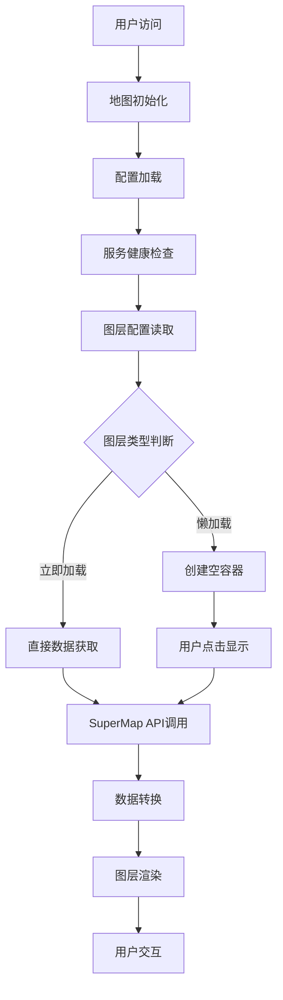

# SuperMap 数据读取流程文档

## 概述

本文档详细说明了前端系统如何从 SuperMap iServer 服务读取地理数据的完整流程，包括配置管理、数据加载、图层渲染等各个环节。

## 1. 系统架构

### 1.1 模块化架构设计

系统采用模块化设计，将数据读取相关功能拆分为以下模块：

```
useMap.ts (主入口)
├── useMapStyles.ts    - 样式管理
├── useMapData.ts      - 数据加载 ⭐核心模块
├── useMapInteraction.ts - 用户交互
└── useMapLifecycle.ts - 生命周期管理
```

### 1.2 数据流向图



## 2. 配置系统

### 2.1 环境变量配置

系统通过环境变量动态配置 SuperMap 服务连接参数：

| 环境变量 | 说明 | 示例值 |
|---------|------|--------|
| `VITE_SUPERMAP_BASE_URL` | 服务器基础地址 | `http://localhost:8090` |
| `VITE_SUPERMAP_DATA_SERVICE` | 数据服务路径 | `iserver/services/data-xxx/rest/data` |
| `VITE_SUPERMAP_MAP_SERVICE` | 地图服务路径 | `iserver/services/map-xxx/rest` |
| `VITE_SUPERMAP_WORKSPACE` | 工作空间名称 | `workspace_name` |
| `VITE_SUPERMAP_MAP_EXTENT` | 地图边界范围 | `[minX,minY,maxX,maxY]` |

### 2.2 图层配置结构

```typescript
interface LayerConfig {
  name: string;          // 图层名称，格式：数据集@数据源@@工作空间
  type: string;          // 几何类型：point/line/polygon
  visible: boolean;      // 初始可见性
  lazyLoad: boolean;     // 是否懒加载
  zIndex?: number;       // 图层层级
}
```

## 3. 数据读取核心流程

### 3.1 图层加载总流程

```typescript
// 文件位置：src/composables/useMapData.ts
const loadVectorLayers = async (map: any): Promise<void> => {
  const apiConfig = createAPIConfig()
  
  for (const layerConfig of apiConfig.wuhanlayers) {
    const layerName = layerConfig.name.split('@')[0]
    
    // 🔍 重复检查机制
    const existingLayer = mapStore.vectorlayers.find(l => 
      l.id === layerConfig.name || l.name === layerName
    )
    
    if (existingLayer) {
      console.log(`图层 ${layerName} 已存在，跳过加载`)
      continue
    }
    
    // 📋 加载策略判断
    const shouldLoadImmediately = !layerConfig.lazyLoad && layerConfig.visible
    
    if (shouldLoadImmediately) {
      // 🚀 立即加载
      loadTasks.push(loadVectorLayer(map, layerConfig, true))
    } else {
      // 💤 懒加载：创建空容器
      createLazyLayerContainer(map, layerConfig)
    }
  }
}
```

### 3.2 单个图层数据获取详细流程

#### 步骤1：图层名称解析
```typescript
// 解析图层名称格式：武汉_县级@wuhan@@workspace
const parts = layerConfig.name.split('@');
const dataset = parts[0];    // 数据集名称：武汉_县级
const datasource = parts[1]; // 数据源名称：wuhan
const workspace = parts[2];  // 工作空间名称：workspace
```

#### 步骤2：获取元数据信息
```typescript
// HTTP GET 请求获取图层元数据
const metaUrl = `${dataUrl}/datasources/${datasource}/datasets/${dataset}/features.json`;
const metaResponse = await fetch(metaUrl);
const metadata = await metaResponse.json();

// 解析元数据
const startIndex = metadata.startIndex || 0;
const featureCount = metadata.featureCount || 20;
const totalFeatures = startIndex + featureCount - 1;
```

#### 步骤3：空间边界设置
```typescript
// 从配置中获取地图边界，用于空间过滤
const mapExtent = apiConfig.mapBounds.extent;
const mapBounds = new ol.geom.Polygon([[
  [mapExtent[0], mapExtent[1]], // 左下角
  [mapExtent[2], mapExtent[1]], // 右下角
  [mapExtent[2], mapExtent[3]], // 右上角
  [mapExtent[0], mapExtent[3]], // 左上角
  [mapExtent[0], mapExtent[1]]  // 闭合
]]);
```

#### 步骤4：首页数据获取
```typescript
// 使用 SuperMap FeatureService 获取要素数据
const featureService = new ol.supermap.FeatureService(dataUrl);

const params = new ol.supermap.GetFeaturesByBoundsParameters({
  datasetNames: [`${datasource}:${dataset}`],
  bounds: ol.extent.boundingExtent(mapBounds.getCoordinates()[0]),
  returnContent: true,
  returnFeaturesOnly: true, // ⭐ 性能优化：只返回要素数据
  maxFeatures: -1,
  fromIndex: startIndex,
  toIndex: Math.min(startIndex + 10000 - 1, totalFeatures)
});

featureService.getFeaturesByBounds(params, (result) => {
  if (result.result?.features) {
    // 🔄 GeoJSON 转 OpenLayers 要素
    const features = new ol.format.GeoJSON().readFeatures(result.result.features);
    vectorLayer.getSource().addFeatures(features);
    
    // 🔄 启动分页加载
    startPaginationLoad(startIndex + 10000, totalFeatures);
  }
});
```

#### 步骤5：分页加载机制
```typescript
const startPaginationLoad = (startFrom: number, totalCount: number) => {
  setTimeout(async () => {
    const pageSize = 10000;
    
    for (let start = startFrom; start <= totalCount; start += pageSize) {
      const end = Math.min(start + pageSize - 1, totalCount);
      
      // 📄 分页请求
      await loadPageData(start, end);
    }
  }, 100); // 延迟100ms，避免阻塞主线程
};
```

## 4. 懒加载机制

### 4.1 懒加载容器创建
```typescript
const createLazyLayerContainer = (map: any, layerConfig: any): void => {
  // 🎨 创建样式
  const style = createLayerStyle(layerConfig, layerName);
  
  // 📦 创建空容器
  const vectorLayer = new ol.layer.Vector({
    source: new ol.source.Vector({}), // 空数据源
    style: style,
    visible: layerConfig.visible
  });
  
  // 🏷️ 设置标识
  vectorLayer.set('isLazyLoaded', true);
  vectorLayer.set('isLoaded', false);
  
  // 💾 存储到状态管理
  mapStore.vectorlayers.push({
    id: layerName,
    name: layerName,
    layer: vectorLayer,
    visible: layerConfig.visible,
    isLazyLoaded: true,
    isLoaded: false
  });
};
```

### 4.2 按需数据加载
```typescript
const loadLazyLayer = async (layerName: string): Promise<boolean> => {
  const layerInfo = mapStore.vectorlayers.find(l => 
    l.name === layerName && l.isLazyLoaded
  );
  
  if (layerInfo?.isLoaded) {
    return true; // 已加载，直接返回
  }
  
  // 🚀 执行实际数据加载
  const layerConfig = layerInfo.layer.get('layerConfig');
  await loadVectorLayer(mapStore.map, layerConfig, true);
  
  // ✅ 更新加载状态
  layerInfo.isLoaded = true;
  layerInfo.layer.set('isLoaded', true);
  
  return true;
};
```

### 4.3 内存管理 - 数据卸载
```typescript
const unloadLazyLayer = async (layerName: string): Promise<boolean> => {
  const layerInfo = mapStore.vectorlayers.find(l => 
    l.name === layerName && l.isLazyLoaded
  );
  
  if (!layerInfo?.isLoaded) {
    return true; // 未加载，无需卸载
  }
  
  // 🗑️ 清空数据源
  const source = layerInfo.layer.getSource();
  if (source) {
    source.clear();
  }
  
  // 👁️ 隐藏图层
  layerInfo.layer.setVisible(false);
  
  // 📊 更新状态
  layerInfo.isLoaded = false;
  layerInfo.layer.set('isLoaded', false);
  
  return true;
};
```

## 5. 数据格式与转换

### 5.1 SuperMap 返回的数据格式
```json
{
  "result": {
    "features": [
      {
        "type": "Feature",
        "geometry": {
          "type": "Polygon",
          "coordinates": [[[114.1, 30.5], [114.2, 30.5], ...]]
        },
        "properties": {
          "SMID": 1,
          "SMUSERID": 0,
          "SMAREA": 2247036621.6979637,
          "SMPERIMETER": 277043.97961264406,
          "PAC_1": 420116,
          "NAME_1": "黄陂区",
          "geometryType": "REGION"
        }
      }
    ],
    "totalCount": 247,
    "currentCount": 20
  }
}
```

### 5.2 数据转换过程
```typescript
// 🔄 GeoJSON 转 OpenLayers 要素
const features = new ol.format.GeoJSON().readFeatures(serviceResult.result.features);

// 📊 要素属性访问
const properties = feature.getProperties();
// properties 包含所有 SuperMap 字段：
// - SMID: SuperMap 内部ID
// - SMUSERID: 用户ID  
// - SMAREA: 面积（平方米）
// - SMPERIMETER: 周长（米）
// - 自定义字段: PAC_1, NAME_1 等
```

## 6. 性能优化策略

### 6.1 全局清理机制（✅ 最新优化）
```typescript
// 🚀 主动清理策略：在地图初始化前彻底清空所有数据
const clearAllStatesAndLayers = (): void => {
  console.log('=== 开始全局状态和图层清理 ===')
  
  // 1. 清理图层数据（SuperMap服务图层 + 本地图层）
  mapData.clearAllLayersBeforeInit()
  
  // 2. 清理选择状态
  selectionStore.clearSelection()
  
  // 3. 清理分析状态
  analysisStore.closeTool()
  analysisStore.setDrawMode('')
  
  // 4. 清理最短路径分析状态
  shortestPathStore.clearAll()
  
  // 5. 清理地图量测状态
  if (mapStore.distanceMeasureMode) {
    mapStore.clearDistanceMeasure()
  }
  if (mapStore.areaMeasureMode) {
    mapStore.clearAreaMeasure()
  }
}
```

### 6.2 图层数据清理详情
```typescript
const clearAllLayersBeforeInit = (): void => {
  // 统计清理信息
  const supermapLayersCount = mapStore.vectorlayers.filter(l => l.source === 'supermap').length
  const localLayersCount = mapStore.vectorlayers.filter(l => l.source === 'local').length
  const customLayersCount = mapStore.customlayers.length
  
  // 从地图中移除所有图层
  if (mapStore.map) {
    mapStore.vectorlayers.forEach(item => {
      try { 
        mapStore.map.removeLayer(item.layer)
      } catch (_) { /* 静默处理 */ }
    })
    
    mapStore.customlayers.forEach(item => {
      try { 
        mapStore.map.removeLayer(item.layer)
      } catch (_) { /* 静默处理 */ }
    })
  }
  
  // 清空数组
  mapStore.vectorlayers.length = 0
  mapStore.customlayers.length = 0
  
  // 清空选择图层数据源
  if (mapStore.selectlayer?.getSource) {
    mapStore.selectlayer.getSource().clear()
  }
}
```

### 6.3 分页加载策略
- **页面大小**: 10,000 个要素/页
- **延迟加载**: 首页加载后延迟 100ms 开始分页
- **异步处理**: 不阻塞主线程
- **错误处理**: 静默处理分页错误

### 6.4 空间过滤优化
- 使用配置的地图边界进行空间过滤
- 减少不必要的数据传输
- 提升加载速度

### 6.5 内存管理
- 懒加载图层支持数据卸载
- 释放不需要的要素数据
- 保留图层容器结构

## 7. 错误处理与监控

### 7.1 服务健康检查
```typescript
const healthCheck = await superMapClient.checkServiceHealth();
if (!healthCheck.success) {
  throw new Error(`SuperMap服务不可用: ${healthCheck.error}`);
}
```

### 7.2 加载状态通知
```typescript
notificationManager.info(
  `图层 ${layerName} 加载完成`,
  `共 ${features.length} 个要素\n` +
  `数据来源: SuperMap iServer\n` +
  `服务器地址: ${mapStore.mapConfig.dataUrl}`
);
```

## 8. API 接口说明

### 8.1 SuperMap REST API 使用

#### 获取要素集合信息
```
GET {serverUrl}/datasources/{datasourceName}/datasets/{datasetName}/features.json
```

#### 按边界获取要素
```
POST {serverUrl}/featureResults.json
Content-Type: application/json

{
  "datasetNames": ["datasource:dataset"],
  "getFeatureMode": "BOUNDS",
  "bounds": {...},
  "returnContent": true,
  "returnFeaturesOnly": true
}
```

### 8.2 主要方法说明

| 方法名 | 功能 | 参数 | 返回值 |
|--------|------|------|--------|
| `loadVectorLayers()` | 加载所有矢量图层 | `map: ol.Map` | `Promise<void>` |
| `loadVectorLayer()` | 加载单个图层 | `map, layerConfig, visible?` | `Promise<void>` |
| `loadLazyLayer()` | 加载懒加载图层数据 | `layerName: string` | `Promise<boolean>` |
| `unloadLazyLayer()` | 卸载懒加载图层数据 | `layerName: string` | `Promise<boolean>` |

## 9. 调试与故障排除

### 9.1 常见问题

**问题1**: 图层重复加载
- **原因**: 页面刷新时未检查已存在图层
- **解决**: 已实现重复检查机制

**问题2**: 加载性能慢
- **原因**: 大数据量同步加载
- **解决**: 实现分页加载和懒加载

**问题3**: 内存占用过高
- **原因**: 所有图层数据常驻内存
- **解决**: 实现懒加载数据卸载

### 9.2 调试日志
系统提供详细的控制台日志：
- 图层加载状态
- 数据获取进度  
- 错误信息记录
- 性能统计信息

## 10. 总结

SuperMap 数据读取系统采用模块化架构，支持多种加载策略，具备完善的性能优化和错误处理机制。通过配置化管理、懒加载机制和分页加载，确保了系统的高性能和良好的用户体验。

系统的核心优势：
- ✅ **模块化设计**: 职责清晰，便于维护
- ✅ **懒加载机制**: 按需加载，节省资源
- ✅ **分页加载**: 大数据集友好
- ✅ **重复检查**: 避免资源浪费
- ✅ **错误处理**: 健壮的异常处理
- ✅ **性能监控**: 完整的加载统计
