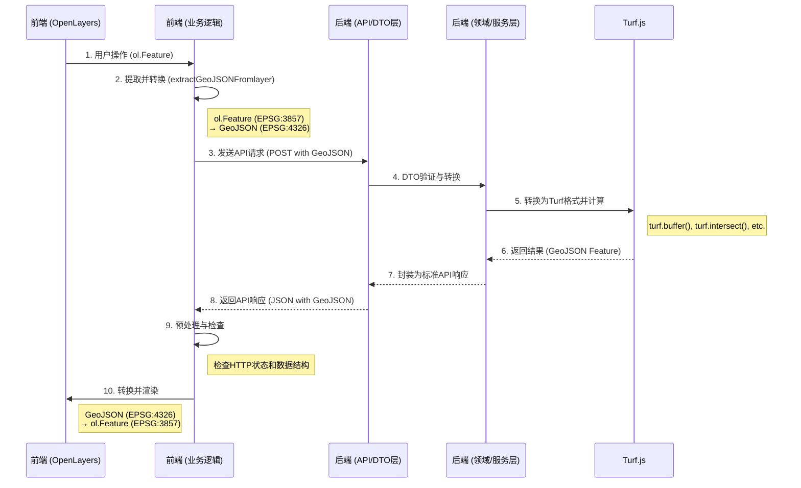

# 空间分析数据链路全流程

这是一个经典的前后端分离、数据驱动的空间分析流程，数据链路清晰地展示了从前端用户操作到后端计算再返回前端渲染的全过程。

## 数据链路流程图



## 各阶段详细说明

### 1. **发送API之前：数据为OpenLayers格式要素**

- **状态**：数据此时存在于前端内存中，由OpenLayers的`VectorSource`管理，每个要素都是一个`ol.Feature`对象。
- **关键细节**：
    - **坐标系**：此时要素的坐标系通常是**EPSG:3857**（Web墨卡托投影），这是Web地图通用的显示坐标系。
    - **数据结构**：`ol.Feature`包含`ol.geom.Geometry`（几何）和`properties`（属性）。

### 2. **执行分析：OpenLayers要素 → GeoJSON**

- **状态**：用户点击执行按钮后，前端业务逻辑层（例如`useBufferAnalysis.ts`）会调用一个核心函数来处理数据。
- **关键函数**：`extractGeoJSONFromlayer()`
- **处理流程**：
    1.  从`VectorSource`中获取所有`ol.Feature`对象数组。
    2.  使用OpenLayers内置的`ol.format.GeoJSON`格式化工具。
    3.  调用`geoJSONFormat.writeFeatures(features, { ... })`方法，该方法执行两个关键操作：
        - **完整转换**：将`ol.Feature`的**几何和属性**都完整地转换为GeoJSON Feature格式。
        - **投影转换**：将坐标系从`featureProjection: 'EPSG:3857'`（地图显示）转换为`dataProjection: 'EPSG:4326'`（WGS 84，后端API和Turf.js期待的格式）。
    4.  最终得到一个标准的GeoJSON `FeatureCollection`字符串，然后通过`JSON.parse()`转换为对象。

### 3. **后端处理：GeoJSON → Turf → GeoJSON**

- **状态**：这是后端的核心处理流程，完美体现了DDD分层架构。
- **处理流程**：
    1.  **API/应用层**：Controller接收到HTTP请求，请求体中的GeoJSON数据被传递给DTO（数据传输对象）进行验证和结构化。
    2.  **基础设施层**：`geometryConverter.js`中的`convertGeoJSONToTurfGeometry()`函数被调用，它将标准的GeoJSON Feature转换为Turf.js可以直接操作的Feature对象。**此步骤会完整保留`properties`**。
    3.  **领域层**：`...AnalysisService.js`接收到Turf Feature，调用相应的`turf.*`函数（如`turf.buffer`）进行计算。
    4.  **结果返回**：Turf.js计算后返回的结果**本身就是一个标准的GeoJSON Feature**，因此**无需再次转换**。
    5.  **应用/API层**：将Turf.js返回的GeoJSON Feature封装在项目统一的API响应结构中（`{ success: true, data: { features: [...] } }`），然后返回给前端。

### 4. **前端接收与渲染：GeoJSON → OpenLayers要素**

- **状态**：前端有预处理和检查，并且最终会渲染数据，但不是直接渲染GeoJSON。
- **预处理与检查**：
    1.  **HTTP状态检查**：首先检查`response.ok`，确保请求成功（状态码2xx）。
    2.  **数据结构检查**：然后检查返回的JSON对象是否包含预期的`data`和`data.features`字段，确保响应是有效的。
        ```typescript
        if (!apiResponse.data || !apiResponse.data.features) {
          throw new Error('API响应格式错误：缺少features数据');
        }
        ```

- **渲染流程**：
    1.  从响应中提取`apiResponse.data.features`数组，这个数组里是标准的GeoJSON Feature对象。
    2.  **关键步骤：** 前端**不会直接渲染GeoJSON**。它会再次使用`ol.format.GeoJSON`格式化工具。
    3.  调用`geoJSONFormat.readFeature(feature, { ... })`或`readGeometry()`方法，将每个GeoJSON Feature转换回`ol.Feature`对象。这个过程也会将坐标系从`dataProjection: 'EPSG:4326'`转换回`featureProjection: 'EPSG:3857'`，以便在地图上正确显示。
    4.  将新创建的`ol.Feature`对象数组添加到一个新的`VectorSource`中，该`VectorSource`关联到一个`VectorLayer`，最终在地图上显示出来。

## 总结

这是一个非常标准且高效的数据闭环：`OpenLayers → GeoJSON → API → Turf.js → GeoJSON → API → GeoJSON → OpenLayers`。每个环节都有明确的格式转换和坐标转换，确保了数据在不同系统和库之间的正确流转。